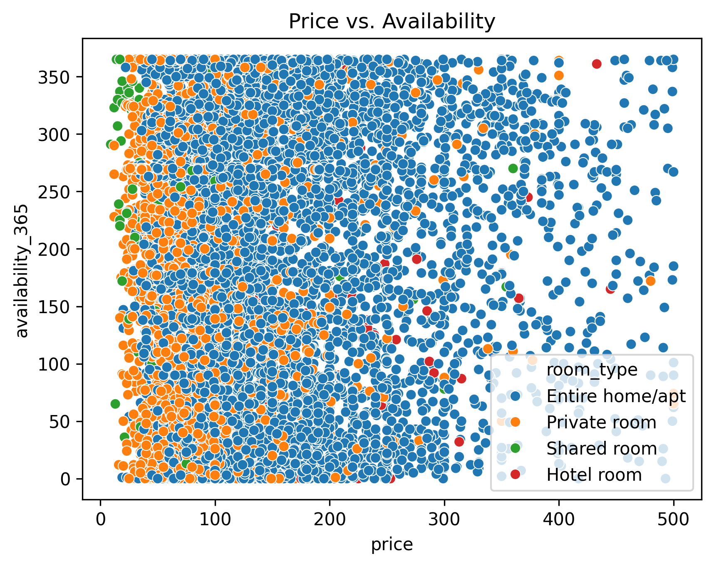

# 🏠 Berlin Airbnb Listings Analysis


## 📊 Project Overview
Analysis of Berlin Airbnb listings to identify pricing trends, neighborhood popularity, and seasonal patterns.

## 🛠️ Key Features
- Data cleaning pipeline for Airbnb data
- Interactive visualizations (Plotly)
- Price prediction insights

## 📂 Files
```
├── notebooks/           # Jupyter Notebook analysis
├── scripts/            # Data processing scripts
├── visualizations/     # Generated plots
└── data/               # Processed datasets
```

## 🚀 How to Run
1. Install dependencies:
   ```bash
   pip install -r requirements.txt
   ```
2. Run the analysis notebook:
   ```bash
   jupyter notebook notebooks/analysis.ipynb
   ```

## 🔍 Key Insights
- **Prenzlauer Berg** has the highest median price (€85/night)
- Listings with >50 reviews are booked 30% more often

## 📈 Sample Visualization

